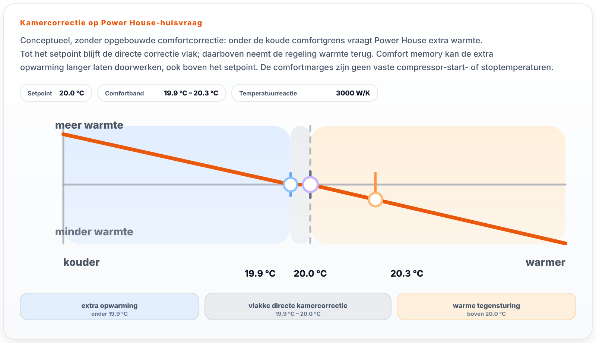

# Power House

Deze pagina is bedoeld voor gebruikers die `Power House` net iets beter willen begrijpen, zonder in interne regelcode te duiken.

> Zoek je vooral de korte uitleg? Begin dan bij [Verwarmen en comfort](dagelijks/verwarmen.md).

> Wil je comfort of langer doorverwarmen instellen? Zie [Power House comfortregeling in de web-app](web-app/instellingen.md#power-house-comfortregeling).

## Wat is Power House in gewone taal?

`Power House` stuurt niet eerst op een vaste aanvoertemperatuur, maar op de warmtevraag van het huis.

De gedachte is simpel:

- bij zacht weer heeft het huis minder warmte nodig;
- bij koud weer heeft het huis meer warmte nodig;
- als de kamer te koud wordt, vraagt `Power House` extra warmte;
- als de kamer te warm wordt, remt `Power House` juist af.

Daarom voelt deze strategie vaak meer als sturen op comfort dan als sturen op een klassieke stooklijn.

## Wanneer kies je dit?

`Power House` past meestal goed als je:

- vooral op kamertemperatuur en comfort wilt sturen;
- rustige, langere runs wilt;
- wilt dat OpenQuatt zelf slim omgaat met `Single` of `Duo`;
- minder wilt denken in "welke aanvoertemperatuur hoort vandaag bij het weer?".

Werk je liever direct met een stooklijn en aanvoertemperatuur, dan past [Water Temperature Control](water-temperature-control.md) vaak beter.

## Wat doet het systeem bij te koud, goed of te warm?

`Power House` berekent de warmtevraag uit de woningbehoefte en een kamercorrectie. De gewenste kamertemperatuur is geen automatische uitknop. In **Power House — comfort** staan daarom **Op temperatuur houden** en het optionele **Langer doorverwarmen** apart herkenbaar bij elkaar.

### Te koud

Onder de normale koude grens vraagt OpenQuatt extra warmte boven op de normale huisvraag. Die grens is het setpoint min `Power House comfort below setpoint`, in de web-app **Reageren op afkoeling**.

Praktisch merk je dan:

- de warmtevraag loopt op;
- de compressorvraag blijft makkelijker actief;
- het systeem probeert de ruimte weer rustig terug richting setpoint te brengen.

### Bijna goed

Zonder opgebouwde comfortcorrectie blijft de directe kamercorrectie vlak tussen de koude comfortgrens en het setpoint. Opgebouwde comfort memory kan de extra opwarming langer laten doorwerken, ook boven het setpoint.

Praktisch merk je dan:

- geen nerveus op- en afschakelen rond een paar tienden graad;
- minder kans op pendelen;
- een gelijkmatiger comfortgevoel.

### Te warm

Zonder opgebouwde comfortcorrectie remt `Power House` de warmtevraag al boven het setpoint af. Comfort memory kan die tegensturing nog uitstellen. `Power House comfort above setpoint` beïnvloedt de herstelcorrectie en de afbouw daarvan; zij is geen bovengrens van een aan/uit-band of compressor-stoptemperatuur.

Praktisch merk je dan:

- minder warmtevraag;
- sneller terugnemen als de ruimte wegdrijft;
- minder kans dat het systeem te lang blijft doorduwen.

## Waar kijkt Power House vooral naar?

De kern bestaat uit vijf onderdelen.

### 1. Het huismodel

OpenQuatt schat eerst hoeveel warmte het huis ongeveer nodig heeft op basis van buitentemperatuur.

Belangrijke instellingen:

- `House cold temp`
- `Maximum heating outdoor temperature`
- `Rated maximum house power`

Samen bepalen die hoe "zwaar" jouw woning aanvoelt voor de regeling.

### 2. Kamercorrectie

Daarna kijkt `Power House` of de kamer te koud, ongeveer goed of te warm is.

Belangrijke instellingen:

- `Power House comfort below setpoint`
- `Power House comfort above setpoint`
- `Power House temperature reaction`

Dit deel bepaalt vooral hoe fel of juist rustig de regeling op kamerafwijking reageert.

**Reageren op afkoeling** staat direct in de gewone bediening. **Temperatuurreactie** en **Comfort boven setpoint** staan onder **Geavanceerd: afstelling van de regeling**. De firmware-entiteiten en opgeslagen waarden blijven hetzelfde.

#### Directe correctie en herstel van eerdere achterstand

Zonder opgebouwde herstelcorrectie geldt:

```text
koude grens = setpoint − comfort below
kamer onder koude grens: correctie = (koude grens − kamer) × temperatuurreactie
kamer tussen koude grens en setpoint: directe correctie = 0 W
kamer boven setpoint: correctie = (setpoint − kamer) × temperatuurreactie
```

Die correctie komt boven op de woningbehoefte. Daarna volgen vermogensbegrenzing, opbouw-/afbouwvertraging, waterbegrenzing en de keuze van een geschikte warmtepompcombinatie.



Bij aanhoudend te koud zijn bouwt de regeling een kleine herstelcorrectie (*comfort memory*) op. Die verschuift intern de koude correctiegrens omhoog; de ingestelde gewenste temperatuur verandert niet. De eerdere achterstand kan daardoor nog extra opwarming geven als de kamer inmiddels dichter bij het setpoint zit.

`Comfort above` heeft meerdere effecten. Met onder- en bovenmarge begrensd op 0–2 °C is de maximale interne verschuiving `clamp(0,05 + 0,50 × comfort above, 0,08, 0,20) °C`. De opbouw hangt af van de achterstand en duurt bij constante achterstand ongeveer 24–90 minuten tot dit maximum. Afbouw begint boven het midden van `setpoint − comfort below` en `setpoint + comfort above`: op een tempo van het maximum per 40 minuten, of per 12 minuten boven de laatste grens. Een grotere bovenmarge geeft dus niet onbeperkt meer herstelcorrectie en is geen toegestane temperatuuroverschrijding.

De directe berekening gebruikt eerst `setpoint + memory − comfort below` als koude correctiegrens. Alleen als de kamer daar niet onder zit, wordt boven het oorspronkelijke setpoint warmte teruggenomen. Bij ondermarge **0,1 °C** en opgebouwde verschuiving **0,2 °C** kan bij **21,05 °C** en setpoint **21,0 °C** dus nog positieve correctie bestaan. Bij ondermarge **0,2 °C** en hetzelfde maximum is dat boven het setpoint niet mogelijk.

#### Rekenvoorbeeld van warmtevraag

Illustratief: setpoint **21,0 °C**, ondermarge **0,2 °C**, woningbehoefte **2.400 W**, temperatuurreactie **3.000 W/K**. De tabel toont de berekening vóór verdere vertraging en begrenzing, niet het onmiddellijk geleverde vermogen.

| Kamer en voorgeschiedenis | Directe correctie | Vraag vóór verdere begrenzing |
| --- | --- | --- |
| 21,0 °C, geen herstelcorrectie | 0 W | 2.400 W: het setpoint bereiken betekent niet automatisch stoppen |
| 20,9 °C, geen herstelcorrectie | 0 W | 2.400 W: nog boven de koude grens |
| 20,7 °C, geen herstelcorrectie | +300 W | 2.700 W: 0,1 °C onder de koude grens |
| 20,9 °C, aangenomen herstelcorrectie 0,15 °C | +150 W | 2.550 W: extra opwarming werkt nog door |
| 21,3 °C, geen herstelcorrectie | −900 W | 1.500 W: warmte wordt teruggenomen |

Dezelfde actuele kamertemperatuur kan dus een andere vraag geven na een eerdere achterstand. Bij een aangenomen laagste geschikt vermogen van **1.700 W** mag langer doorverwarmen een lopende run in de laatste rij tot **1.700 W** ondersteunen. Er bestaat geen vaste temperatuurgrens waar dat minimumvermogen begint.

### 3. Reactiesnelheid

De berekende warmtevraag wordt niet abrupt doorgezet. OpenQuatt bouwt vraag bewust op en af.

Belangrijke instellingen:

- `Power House response profile`
- `Power House demand rise time`
- `Power House demand fall time`

Korter betekent sneller reageren. Langer betekent rustiger gedrag.

### 4. Begrenzing op water

Ook in `Power House` blijft de aanvoertemperatuur een veiligheid en rem.

Belangrijke instelling:

- `Maximum water temperature`

Als de aanvoer al hoog zit, neemt OpenQuatt de warmtevraag terug.

### 5. Verdeling naar compressor(en)

Pas daarna vertaalt OpenQuatt de warmtevraag naar compressorlevels.

Dat is belangrijk, want vreemd gedrag komt niet altijd uit het huismodel zelf. Soms zit het juist in:

- verkeerde bronkeuze;
- begrenzing op water;
- of de verdeling over één of twee warmtepompen.

## Warmtetoestemming: meestal Niet gebruiken

`Heating Enable Source = Niet gebruiken` betekent: geen externe warmtetoestemming; de actieve verwarmingsstrategie mag zelf warmtevraag opbouwen. Dit is voor `Power House` meestal de juiste keuze.

`Power House` berekent zelf continu hoeveel warmte de woning nodig heeft uit buitentemperatuur, kamertemperatuur, setpoint en huismodel. Een externe `Heating Enable` als harde gate (bijvoorbeeld `OT thermostat` CH-enable) zet daar een tweede regelaar achter: eerst bepaalt Power House de vraag, daarna kan de thermostaat die vraag hard aan/uit zetten. Dat verstoort het rustige/modulerende karakter en geeft extra stop/start.

Gebruik een externe warmtetoestemming bij `Power House` alleen bewust, bijvoorbeeld als een zone-regeling als harde toestemming dient wanneer geen enkele zone openstaat.

Tijdens Quick Start zet een strategieswitch naar `Power House` daarom automatisch `Heating Enable Source = Niet gebruiken`; een bestaande keuze wordt in die onboardingstap bewust vervangen. Buiten Quick Start wordt de instelling niet stil overschreven. In `Instellingen → Verwarmen` en `Instellingen → Bronnen / integraties → Sensorselectie` zie je dan alleen een advies wanneer de huidige keuze afwijkt, met een knop om het advies over te nemen. Afwijkende combinaties blijven geldig.

Voor de volledige matrix per strategie zie [Instellingen en meetwaarden](instellingen-en-meetwaarden.md#5-bronselectie).

## Externe warmtevraag (optioneel)

Standaard rekent `Power House` zelf uit hoeveel vermogen het huis nodig heeft, uit de buitentemperatuur en het huismodel. Heb je een eigen voorspelling die verder kijkt dan dat — bijvoorbeeld een model dat zonnewinst, wind of bewoningspatroon meeneemt — dan kun je die vraag rechtstreeks aan `Power House` doorgeven.

Zet daarvoor `External Heat Demand Source` op `HA input` of `API input` en lever een waarde in watt. Staat de bron op `Disabled`, dan verandert er niets aan het gedrag dat je nu kent.

Voor `HA input` luistert OpenQuatt naar twee vaste entiteiten in Home Assistant:

- `sensor.openquatt_ext_heat_demand` — de gevraagde warmte in watt;
- `binary_sensor.openquatt_ext_heat_demand_valid` — moet `on` staan, anders negeert OpenQuatt de waarde en valt hij terug op het huismodel.

Het eenvoudigst maak je die aan met het package [dynamic-sources.yaml](https://github.com/OpenQuatt/home-assistant-openquatt/blob/main/packages/dynamic-sources.yaml): vul daar de helper `input_text.openquatt_source_heat_demand` met de entiteit van je eigen voorspelling, dan publiceert het package beide entiteiten voor je. Je kunt ze ook zelf aanmaken. Dat package levert ook een centrale heartbeat (`sensor.openquatt_ha_ingress_heartbeat`): zolang die binnenkomt, blijft een constante warmtevraag gewoon bruikbaar; blijft hij 15 minuten uit, dan wordt de waarde ongeldig.

Die tweede entiteit is jouw eigen geldigheidsschakelaar: zet hem `off` zodra je voorspelling verouderd of onbetrouwbaar is. De namen liggen vast in de firmware en zijn alleen in een eigen build aan te passen, via de substituties `ha_external_heat_demand_entity_id` en `ha_external_heat_demand_valid_entity_id`.

Voor `API input` stuur je de waarde naar een lokaal endpoint; zie [API inputbronnen](api-input.md). Die weg heeft geen aparte geldigheidsentiteit maar een eigen vervaltijd van 15 minuten.

Wat die externe waarde wel en niet doet:

- Hij vervangt alleen de vermogensschatting uit het huismodel.
- De kamercorrectie, de begrenzing op `Rated maximum house power`, de reactiesnelheid, de waterbegrenzing en de vorstbeveiliging blijven van OpenQuatt zelf.
- Valt de bron weg, wordt hij te oud of stuurt hij een onbruikbare waarde, dan gaat `Power House` terug naar het eigen huismodel. Niet naar nul.

Reken de kamercorrectie niet als begrenzing. Komt de kamer boven het setpoint, dan trekt hij `Power House temperature reaction` watt per graad van de vraag af — met de standaardinstellingen 3000 W per graad. Van een externe vraag van 7020 W blijft bij een halve graad overschrijding dus nog 5520 W over, en pas rond 2,3 graden erboven valt de vraag helemaal weg. Een te hoge externe vraag wordt gedempt, maar kan de kamer wel degelijk warmer maken dan gevraagd.

Wil je warmte in de tijd verschuiven, bijvoorbeeld voorverwarmen bij veel zon, dan is het kamer-setpoint daarvoor de juiste knop en niet de warmtevraag.

Kijk bij twijfel naar `Power House – demand source`. Die staat op `external` zolang de externe vraag echt gebruikt wordt, en op `model` zodra `Power House` op het eigen huismodel terugvalt.

## Welke instellingen zijn voor de meeste gebruikers het belangrijkst?

Als je `Power House` wilt afstellen, begin dan bijna altijd hier:

1. `Rated maximum house power`
2. `House cold temp`
3. `Maximum heating outdoor temperature`
4. **Reageren op afkoeling** (`Power House comfort below setpoint`)
5. Eventueel **Langer doorverwarmen**, met stopmarge en afkoeling

Daarna eventueel:

6. **Geavanceerd**: `Power House temperature reaction`, `Power House comfort above setpoint` en het reactieprofiel met opbouw-/afbouwtijd
7. `Maximum water temperature`

Verander liever niet meerdere van deze groepen tegelijk.

## Wat merk je bij Single en Duo?

### Single

Bij `Single` is het gedrag het makkelijkst te begrijpen:

- OpenQuatt berekent warmtevraag;
- vertaalt die naar een compressorlevel;
- en houdt daarna rekening met minimum looptijd en rustiger laaglastgedrag.

### Duo

Bij `Duo` kiest OpenQuatt niet automatisch altijd voor één warmtepomp of altijd voor twee.

In gewone taal:

- OpenQuatt kijkt welke combinaties logisch en toegestaan zijn;
- vergelijkt welke combinatie de vraag goed dekt;
- en probeert onnodig wisselen tussen `Single` en `Duo` te vermijden.

Voor de meeste gebruikers is vooral dit belangrijk:

- `Duo` hoeft dus niet altijd "meer vermogen" te betekenen;
- twee warmtepompen tegelijk zijn niet per definitie beter;
- het systeem probeert een praktische en zuinige keuze te maken.

## Langer doorverwarmen (optioneel)

Power House berekent continu hoeveel warmte je woning nodig heeft. **Langer doorverwarmen** bepaalt alleen hoe een bestaande verwarmingsrun bij heel weinig vraag mag doorgaan en daarna opnieuw mag beginnen. De functie staat standaard uit.

### Wat gebeurt er wanneer je het aanzet?

1. De warmtepomp moet eerst vanwege de normale warmtevraag gaan verwarmen. Inschakelen start een stilstaande warmtepomp niet zelfstandig.
2. Als de woning minder warmte nodig heeft dan het laagste geschikte warmtepompvermogen, mag de run op dat minimumvermogen doorgaan. Dat mag ook wanneer de normale vraag tijdelijk nul is.
3. Bij **Stopgrens boven gewenste temperatuur** wordt een comfortstop aangevraagd. Dit geldt in de geactiveerde cyclus ook als de gewone vraag nog boven het minimumvermogen ligt. De minimumlooptijd kan de daadwerkelijke stop uitstellen. Restwarmte kan de kamer daarna nog verder opwarmen; dit is geen gegarandeerde maximumtemperatuur.
4. Daarna wacht de regeling op afkoeling. **Afkoeling vóór opnieuw verwarmen** wordt gerekend vanaf de ingestelde stopgrens, niet vanaf een eventuele hogere temperatuurpiek door restwarmte.
5. Herstart gebeurt alleen als Power House opnieuw warmte vraagt. Wachttijden en beveiligingen kunnen de daadwerkelijke start uitstellen.

### De instellingen

| In de web-app | Home Assistant / firmware | Bereik en standaard |
|---|---|---|
| Langer doorverwarmen | `Power House run extension` | Aan/uit; standaard uit |
| Stopgrens boven gewenste temperatuur | `Power House run extension stop margin` | 0,1–1,0 °C boven setpoint; standaard 0,5 °C |
| Afkoeling vóór opnieuw verwarmen | `Power House run extension restart cooldown` | 0,1–3,0 °C onder de comfortstop; standaard 0,2 °C |

De getalinstellingen hebben stappen van 0,1 °C en blijven na herstart behouden. In Home Assistant zijn deze extension-entities standaard uitgeschakeld; je kunt ze daar zelf inschakelen. De web-app toont stop- en herstarttemperatuur berekend met de getoonde instellingen. Tijdens bewerken is dat een voorvertoning van je wijziging.

```text
stopgrens = setpoint + stopmarge
normale koude grens = setpoint − comfort below
herstartgrens = max(stopgrens − afkoeling, normale koude grens)
```

Een hogere stopmarge verhoogt bij gelijke afkoeling ook de herstartgrens. Een grotere afkoeling verlaagt de herstartgrens tot de normale koude grens; daarna heeft verder verhogen geen effect op die grens. Een grotere ondermarge verlaagt de normale koude grens en kan daardoor ook verder afkoelen na een comfortstop mogelijk maken.

### Voorbeelden: vroeg herstarten of langer afkoelen

Je gewenste temperatuur is **21,0 °C**, doorverwarmen staat op **+0,7 °C** en je normale comfortmarge onder setpoint is **0,2 °C**. De comfortstop ligt dan op **21,7 °C** en de normale koude comfortgrens op **20,8 °C**.

| Afkoeling vóór opnieuw verwarmen | Opnieuw verwarmen mogelijk vanaf | Betekenis |
|---|---|---|
| 0,2 °C | 21,5 °C | Vroege herstart, nog boven je gewenste temperatuur |
| 0,7 °C | 21,0 °C | Afkoelen tot je gewenste temperatuur |
| 0,9 °C | 20,8 °C | Afkoelen tot je normale koude comfortgrens |
| 1,2 °C | 20,8 °C | Begrensd: de berekende 20,5 °C ligt onder je normale koude comfortgrens |

**De normale koude comfortgrens blijft leidend.** Langer doorverwarmen mag normale warmtevraag niet voorbij die grens tegenhouden. Wil je bewust verder laten afkoelen, dan hoort die keuze bij `Power House comfort below setpoint`. Een grotere marge onder setpoint laat meer afkoeling toe. Beveiligingen blijven ook dan gelden; de grens garandeert niet dat de kamer nooit kouder wordt.

De web-app toont de werkelijke begrensde herstarttemperatuur en legt uit wanneer de koude comfortgrens ingrijpt. Voor de standaard stopmarge +0,5 °C en afkoeling 0,2 °C blijft warme herstart mogelijk vanaf setpoint +0,3 °C, zoals voorheen. Bij een kleine stopmarge en kleine comfortmarge kan de nieuwe koude comfortgrens eerder vrijgave geven dan de oude vaste 0,2 °C-afstand.

Bij een piek van **22,0 °C** door restwarmte blijft de herstartgrens met stopgrens **21,7 °C** en afkoeling **0,7 °C** dus **21,0 °C**. In het vermogensvoorbeeld hierboven is de gewone vraag bij **21,5 °C** slechts **900 W**, zodat herstart tot het minimumvermogen kan worden ondersteund. Bij **21,0 °C** is de vraag **2.400 W**; die hogere vraag mag worden gevolgd. Herstart betekent niet automatisch draaien op minimumvermogen. Een run hoeft bovendien niet altijd tot de stopgrens op te warmen.

### Comfortband en doorverwarmen zijn verschillende dingen

De historische namen `Comfort below/above` beschrijven geen symmetrische aan/uit-band. `Comfort below` beïnvloedt de normale koude grens, kamercorrectie en room intent; `Comfort above` beïnvloedt de herstelcorrectie en afbouw daarvan. De eerste staat in de web-app als **Reageren op afkoeling**, de tweede alleen onder geavanceerd. Zonder opgebouwde herstelcorrectie begint warme tegensturing al boven het setpoint; herstelcorrectie kan de extra opwarming daar nog laten doorwerken.

De stopmarge en herstartafstand horen bij het aparte doorverwarmen-mechanisme. Kleine afkoeling kan passen als je vroeg wilt herstarten; grotere afkoeling geeft opgeslagen warmte meer tijd om af te geven. Er zijn geen aparte regelmodi voor radiatoren, LT-radiatoren en vloerverwarming. Er is geen garantie op lager elektriciteitsverbruik.

### Status, uitschakelen en herstart van de controller

De actuele status laat zien of de regeling **Normaal verwarmt**, **Doorverwarmt op minimumvermogen**, een **Stop heeft aangevraagd**, **Wacht op afkoeling** of een **Herstart heeft aangevraagd**. De firmwarewaarden blijven `normal`, `extending`, `comfort_stop`, `wait_warm_restart` en `warm_restart`. **Herstart aangevraagd** betekent dat herstart is vrijgegeven, niet dat de compressor al draait. De berekende grenzen in het instellingenblok zijn geen bewijs dat een bestaande aanvraag is ingetrokken.

Uitschakelen van langer doorverwarmen schakelt de gewone verwarming niet uit: de normale Power House-vraag kan een run laten doorgaan of later opnieuw starten. Verander je de herstartafstand tijdens wachten, dan geldt de nieuwe grens bij de volgende regeltick. Een al vrijgegeven warme herstart houdt zijn bestaande intent vast; vraaguitval, setpointverlaging en beveiligingen blijven die kunnen beëindigen.

Na reboot of firmware-update blijven de instellingen behouden, maar de historische doorverwarmen-cyclus wordt gewist. Er moet eerst weer een echte verwarmingsrun zijn voordat extension een warme herstart mag vrijgeven. De normale comfortregeling kan ondertussen gewoon warmte vragen.

Alle bestaande beveiligingen blijven leidend: waterbegrenzing, stroomlimieten, minimum aan/uit-tijden, defrost en olieretour. De extra minimumvermogenvraag telt niet mee als woningtekort voor ketelbijschakeling.

## Wat hoef je meestal niet aan te raken?

Voor de meeste gebruikers zijn dit geen eerste afstelknoppen:

- interne optimizer-details rond `Duo`;
- laaglastdrempels die vooral bij technische diagnose helpen;
- compile-time constanten in de firmware;
- details rond runtime lead, ownerwissels en defrostgedrag.

Die informatie is nuttig bij echte analyse, maar zelden de eerste oplossing voor comfortklachten.

## Handige meetwaarden om naar te kijken

Als `Power House` niet logisch lijkt te reageren, kijk dan eerst naar:

- `Outside Temperature (Selected)`
- `Room Temperature (Selected)`
- `Room Setpoint (Selected)`
- `Water Supply Temp (Selected)`
- de actieve `Heating Control Mode`
- `Power House – demand source` en `External Heat Demand (Selected)` als je een externe warmtevraag gebruikt

Controleer daarna pas of de afstelling zelf te scherp of te slap is.

## Veilige volgorde van afstellen

1. Controleer eerst of de gekozen bronnen kloppen.
2. Kijk of het huismodel logisch voelt bij zacht en koud weer.
3. Pas daarna de kamercorrectie aan.
4. Maak pas als laatste het gedrag sneller of trager.
5. Verander steeds maar één groep tegelijk en kijk minstens een tijdje naar het effect.

## Veelvoorkomende misverstanden

- `Power House` is geen gewone kamerthermostaat met een simpele PID.
- Meer reactie is niet automatisch beter; dat kan ook onrust geven.
- `Rise time` en `fall time` zijn niet de echte opwarmtijd van het huis, maar de reactiesnelheid van de regeling.
- `Duo` kiest niet blind altijd voor twee warmtepompen.

## Verder lezen

- [Verwarmen en comfort](dagelijks/verwarmen.md)
- [Water Temperature Control](water-temperature-control.md)
- [Regelgedrag van OpenQuatt](regelgedrag-van-openquatt.md)
- [Instellingen en meetwaarden](instellingen-en-meetwaarden.md)
- [Problemen oplossen](problemen-oplossen.md)
