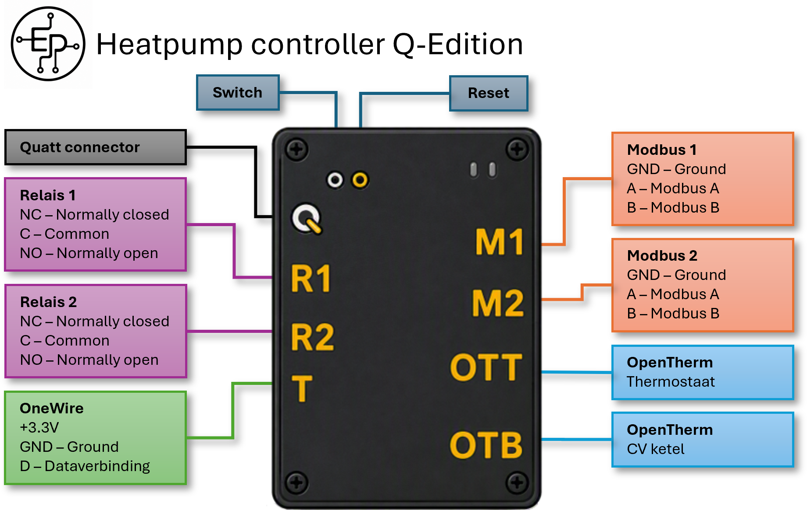

# Heatpump Controller Q-edition aansluiten en in gebruik nemen

Van nieuwe controller naar een werkende OpenQuatt-installatie. De Heatpump Controller Q-edition (HCQ) wordt standaard geleverd met `Single` + `Wi-Fi` voorgeïnstalleerd. Je brengt hem eerst online; de web-app begeleidt je daarna bij de juiste configuratie voor jouw opstelling en netwerkverbinding.

## De hoofdroute in vier stappen

1. Maak de CiC en Quatt-buitenunit(s) spanningsloos, verplaats de kabels en voer de eindcontrole uit.
2. Voed de HCQ, schakel de Quatt-buitenunit(s) weer in en stel Wi-Fi in.
3. Open `openquatt.local` en controleer de basisverbinding.
4. Kies in **Quick Start → Configuratie en software-update** de juiste configuratie. Controleer de stabiele software of behoud, als de gekozen build al actief is, de huidige software zonder OTA. Rond daarna Quick Start af.

Daarna werkt OpenQuatt zelfstandig via de web-app. Home Assistant is een optionele vervolgstap voor dashboards en automatisering.

## 1. Controller aansluiten

Schakel eerst de CiC uit en maak alle Quatt-buitenunits spanningsloos, bijvoorbeeld met de werkschakelaar. Maak daarna een foto van de complete aansluitstrook en label de kabels voordat je iets losmaakt.

> [!WARNING]
> Twijfel je over de bedrading of aansluitingen? Stop dan en laat dit door een vakbekwaam installateur uitvoeren.

De HCQ neemt de signaalkabels van de CiC over. Sluit dezelfde kabel nooit tegelijk op de CiC en de HCQ aan.

### Interactief aansluiten: één stap tegelijk

Gebruik de foto van je eigen CiC als uitgangspunt. De stappenhulp toont steeds één grote stap. Kies een stap bovenaan of gebruik **Vorige** en **Volgende**. Bij stap 4 laat je de ketelkabel nog op de CiC zitten. Vergelijk de aansluiting met de twee voorbeelden en kies OpenTherm of aan/uit. Daarna toont de hulp alleen het bijbehorende aansluitschema.


### Welke kabel gaat waarheen?

Draadkleuren in de schema's en stappenhulp zijn illustratief. De klemmarkeringen en functies zijn altijd leidend.

| Van de CiC | Naar de HCQ | Zo sluit je aan |
|---|---|---|
| Buitenunit(s) · Modbus `A/G/B` | `M1` · `GND/A/B` | Let goed op de juiste volgorde: `A → A` (rood), `G → GND` (groen), `B → B` (blauw). |
| Kamerthermostaat · OpenTherm | `OTT` | Neem de twee aders over. |
| CV-ketel · OpenTherm | `OTB` | Neem de twee aders over. Sluit OTB alleen aan op de digitale OpenTherm-klemmen van de ketel; gebruik voor een aan/uit-kamerthermostaatingang R1. |
| CV-ketel · aan/uit | `R1` · `COM + NO` | Gebruik R1 voor een aan/uit-kamerthermostaatingang (bijv. RT, RT24 of TA). Het CV-aan/uit-contact van de CiC zit onder een apart afdekkapje. Op R1 blijft de bovenste klem `NC` vrij; gebruik de middelste klem `COM` en de onderste klem `NO`. |
| Quatt flowmeter / PT1000 | `Q` | Steek de bestaande Quatt-sensorstekker over. |
| **Optioneel:** vrijgekomen buitenunit-Modbus `A/G/B` op de CiC | `M2` · `GND/A/B` | Gebruik een aparte RS485-kabel: `A → A`, `G → GND`, `B → B`. |

> [!NOTE]
> Bij de OpenTherm-verbindingen (`OTT` en `OTB`) en het aan/uit-contact (`R1`: `COM` + `NO`) maakt de polariteit of volgorde van de twee aders niet uit. Gebruik wel de genoemde aansluitklemmen.

> [!WARNING]
> Een alternatieve B10-flowmeter kan niet rechtstreeks op `Q` worden aangesloten. Voor deze vervanging moet de kabel worden aangepast met een BC547-transistor en een weerstand van 4,7 kΩ. Volg hiervoor de [aansluithandleiding en pinbezetting](hcq-io-overzicht.md#alternatieve-b10-flowmeter-aansluiten).

> [!IMPORTANT]
> Kies voor de CV-ketel óf `OTB` óf `R1`; gebruik beide routes niet tegelijk.

> [!TIP]
> De Modbusverbinding tussen `M2` en de CiC is optioneel. Activeer daarna **Quatt-app via CiC** onder **Instellingen → Bronnen / integraties** om buitenunitgegevens in de Quatt-app te blijven bekijken. Deze functie staat standaard uit en geeft alleen buitenunitgegevens door, geen thermostaatgegevens. OpenQuatt blijft regelen. Dit staat los van **CiC JSON-feed inlezen**, waarmee OpenQuatt juist gegevens uit de CiC leest.

### M1, M2 en de optionele aansluitingen

- **M1** is de primaire Modbuspoort voor de Quatt-buitenunit(s). Deze verbinding is nodig voor de normale regeling.
- **M2** is de optionele Modbuspoort voor Quatt-app via CiC. Verbind M2 alleen met de vrijgekomen Modbuspoort van de CiC als de Quatt-app moet blijven meekijken. M2 is niet nodig voor CiC JSON-feed inlezen.
- **R2** is een tweede potentiaalvrij wisselrelais met `NC`, `COM` en `NO`. R2 kan optioneel als hulprelais worden ingesteld via **Instellingen → Installatie → Hulprelais (R2)**, bijvoorbeeld om een fancoil, pomp of klep te laten volgen op de warmte- of koelvraag van OpenQuatt. Standaard staat deze functie uit en blijft R2 onbekrachtigd. Sluit apparatuur die moet inschakelen bij een actief relais aan op `COM` + `NO`; heb je geen hulpuitgang nodig, laat deze aansluiting dan vrij.
- **T** is een 1-Wire-aansluiting voor een optionele Dallas/DS18B20-temperatuursensor: `+3.3V`, `GND` en `DATA`.

### Aansluitingen op de HCQ

Onderstaand referentiebeeld toont de fysieke positie en functie van alle aansluitingen. De aansluitingen staan op de behuizing aangeduid als `Q`, `R1`, `R2`, `T`, `M1`, `M2`, `OTT` en `OTB`.

[](assets/hcq-aansluitingen-referentie.png)

[Open het referentiebeeld op volledige grootte](assets/hcq-aansluitingen-referentie.png)

Voor de technische functie per aansluiting en de GPIO-koppeling zie [HCQ aansluitingen en technische I/O](hcq-io-overzicht.md).

### Na het overzetten

Controleer in de laatste aansluitstap nog eenmaal `M1`, de gekozen ketelroute, de eventuele `M2`-verbinding en alle stekkers. Sluit daarna de USB-voeding aan op de USB-poort van de HCQ. Schakel vervolgens de Quatt-buitenunit(s) weer in, bijvoorbeeld met de werkschakelaar.

Laat de USB-poort bereikbaar. Je hebt deze later ook nodig voor Wi-Fi provisioning, een firmwarewissel of herstel.

## 2. Wi-Fi instellen

Een Wi-Fi-build biedt twee routes. Op een computer is provisioning via USB meestal het handigst. Op een telefoon of tablet staat de route via het OpenQuatt access point daarom als eerste.

Wil je de HCQ uiteindelijk via Ethernet gebruiken? Breng de geleverde `Single` + `Wi-Fi`-build ook dan eerst via deze stap online en sluit de netwerkkabel aan. In Quick Start kies je daarna de juiste `Single`- of `Duo`-Ethernetsetup; de web-app installeert dan de bijbehorende firmware.

### Route A: via USB

Deze route schrijft alleen de Wi-Fi-gegevens naar de controller en flasht geen nieuwe firmware.

1. Sluit de HCQ met een USB-datakabel aan op je computer.
2. Open de provisioningtool met de knop hieronder.
3. Klik op **Configureer Wi-Fi** en kies de USB-poort van de controller.
4. Vul de netwerknaam en het wachtwoord in.
5. Wacht tot de controller verbinding heeft en open daarna `http://openquatt.local`.

[Configureer Wi-Fi via USB](install/index.html#wifi-provision-panel)

Gebruik deze route ook als alleen de netwerknaam of het Wi-Fi-wachtwoord is gewijzigd.

### Route B: via het OpenQuatt access point

Kan de controller geen verbinding maken met het ingestelde Wi-Fi-netwerk, dan start een Wi-Fi-build een eigen access point met captive portal:

- netwerknaam: `OpenQuatt`;
- wachtwoord: `openquatt`.

1. Open de Wi-Fi-instellingen van je telefoon, tablet of computer.
2. Verbind met het netwerk `OpenQuatt`.
3. Vul het wachtwoord `openquatt` in.
4. Wacht tot de captive portal opent en kies daar je eigen Wi-Fi-netwerk.
5. Vul het Wi-Fi-wachtwoord in en laat de controller verbinden.
6. Verbind je telefoon of computer weer met je normale netwerk.
7. Open `http://openquatt.local`.

Verschijnt de captive portal niet? Blijf verbonden met `OpenQuatt` en open handmatig [http://192.168.4.1/](http://192.168.4.1/) in je browser.

> [!NOTE]
> Het access point is een tijdelijke configuratieroute en niet bedoeld als normale netwerkverbinding. Bij Ethernet is deze route niet beschikbaar.

## 3. OpenQuatt voor het eerst openen

Open na de netwerkverbinding:

```text
http://openquatt.local
```

Werkt deze naam niet, zoek dan het IP-adres van OpenQuatt in je router en open `http://<ip-adres>`.

Controleer voordat je verdergaat:

- de controller blijft online;
- de firmwareversie wordt getoond;
- ten minste de basisgegevens van de eerste warmtepomp worden bijgewerkt.

Gebruik je een Duo-opstelling, of wijkt de gewenste setup af van de voorgeïnstalleerde `Single` + `Wi-Fi`-build? Controleer de tweede warmtepomp en alle meetwaarden pas volledig nadat je in de volgende stap de juiste setup hebt gekozen.

Zie [Web-app gebruiken](web-app.md) voor bediening, updates, backups en beveiliging.

## 4. Quick Start afronden

Quick Start verschijnt zolang de basisinstellingen nog niet zijn afgerond. De eerste stap heet in de web-app **Configuratie en software-update**. De gemarkeerde kaart toont welke configuratie nu actief is; bij levering is dat normaal `Single · Wi-Fi`.

Kies hier direct de combinatie die bij je installatie hoort:

- `Single · Wi-Fi` of `Single · Ethernet` voor één warmtepomp;
- `Duo · Wi-Fi` of `Duo · Ethernet` voor twee warmtepompen.

Sluit bij Ethernet eerst de netwerkkabel aan. Kies alleen `Duo` als de installatie daadwerkelijk twee warmtepompen heeft.

Na bevestiging kun je OpenQuatt de nieuwste stabiele release voor de gekozen configuratie laten controleren. Alleen als de softwareversie of configuratie afwijkt, installeert OpenQuatt de juiste stabiele release en start de controller opnieuw op. Een aanwezige dev- of testbuild wordt daarmee vervangen. Is de gekozen build al actief, dan kun je in plaats daarvan **Huidige software behouden en doorgaan** kiezen; Quick Start gaat dan zonder OTA of herstart verder en het actieve releasekanaal blijft ongewijzigd. Zijn versie en configuratie al correct, dan gaat Quick Start eveneens zonder OTA verder. **Bestaande OpenQuatt-instellingen blijven bij een software-update of configuratiewissel behouden.** Je hoeft bij de eerste ingebruikname dus niet via **Instellingen → Systeem → Updates** te wisselen. Open na een herstart zo nodig opnieuw `http://openquatt.local` en ga verder met Quick Start.

Daarna geef je aan welke Quatt Hybrid en installatie je hebt. V1, V1.5 en V2 beschrijven de generatie van de warmtepomp en staan los van de keuze voor `Single` of `Duo`.

- Kies `V1` bij model `AMM4`: flowmeter bij de CV-ketel en vorstbeveiligingsklep buiten de buitenunit. Dit geldt ook voor een gemengde V1/V1.5 Duo.
- Kies `V1.5` bij model `AMM4-V1.5`: flowmeter in de buitenunit en onder de CV-ketel alleen een kleine clip-on temperatuursensor.
- Kies `V2` bij model `AMH6` of `AMH6-2`: flowmeter in de buitenunit en onder de CV-ketel alleen een kleine clip-on temperatuursensor.

Volg de route die de web-app voor jouw installatie toont. De basisstappen zijn:

1. **Configuratie en software-update:** `Single` of `Duo` en Wi-Fi of Ethernet; controleer de stabiele main-release of behoud de huidige software zonder OTA als de gekozen build al actief is.
2. **Kies je Quatt Hybrid:** V1, V1.5 of V2.
3. **Flowmeting configureren:** controleer en activeer de juiste flowbron.
4. **Thermostaatgegevens configureren:** kies waar kamertemperatuur en kamer-setpoint vandaan komen.
5. **Aanvullende warmtebron:** leg vast of een warmtebron is aangesloten, of deze hybride mag meeverwarmen bij een vermogenstekort en of deze mag overnemen wanneer geen warmtepomp beschikbaar is.
6. **Kies de verwarmingsstrategie:** kies hoe OpenQuatt de …17197 tokens truncated…rows: list[list[str]] = []
                while idx < len(lines) and lines[idx].lstrip().startswith("|"):
                    body_rows.append([cell for cell in lines[idx].split("|")[1:-1]])
                    idx += 1
                header_html = "".join(f"<th>{render_inline(cell.strip(), self.source, self.output)}</th>" for cell in rows)
                body_html = []
                for body_row in body_rows:
                    row_html = "".join(f"<td>{render_inline(cell.strip(), self.source, self.output)}</td>" for cell in body_row)
                    body_html.append(f"<tr>{row_html}</tr>")
                blocks.append(f"<table><thead><tr>{header_html}</tr></thead><tbody>{''.join(body_html)}</tbody></table>")
                continue
            if line.lstrip().startswith(">"):
                quote_lines: list[str] = []
                while idx < len(lines) and lines[idx].lstrip().startswith(">"):
                    quote_lines.append(lines[idx].lstrip()[1:].lstrip())
                    idx += 1
                if quote_lines and re.fullmatch(r"\[![A-Z]+\]", quote_lines[0]):
                    raw_label = quote_lines[0][2:-1]
                    label = CALLOUT_LABELS.get(raw_label, raw_label.title())
                    variant = CALLOUT_VARIANTS.get(raw_label, "note")
                    body = [ln for ln in quote_lines[1:] if ln.strip()]
                    inner = "".join(f"<p>{render_inline(' '.join(body), self.source, self.output)}</p>") if body else ""
                    blocks.append(f'<div class="callout callout-{variant}"><span class="callout-title">{escape(label)}</span>{inner}</div>')
                else:
                    inner = self._render_blocks(quote_lines)
                    blocks.append(f"<blockquote>{inner}</blockquote>")
                continue
            if UL_RE.match(line) or OL_RE.match(line):
                list_html, idx = self._render_list(lines, idx)
                blocks.append(list_html)
                continue
            para_lines = [line.strip()]
            idx += 1
            while idx < len(lines):
                next_line = lines[idx]
                if not next_line.strip():
                    break
                if any(
                    (
                        HEADING_RE.match(next_line),
                        FENCE_RE.match(next_line),
                        UL_RE.match(next_line),
                        OL_RE.match(next_line),
                        next_line.lstrip().startswith(">"),
                        next_line.lstrip().startswith("|"),
                        next_line.lstrip().startswith("<"),
                    )
                ):
                    break
                para_lines.append(next_line.strip())
                idx += 1
            blocks.append(f"<p>{render_inline(' '.join(para_lines), self.source, self.output)}</p>")
        return "\n".join(blocks)

    def _render_list(self, lines: list[str], start: int) -> tuple[str, int]:
        ordered = bool(OL_RE.match(lines[start]))
        match = OL_RE.match(lines[start]) if ordered else UL_RE.match(lines[start])
        assert match
        base_indent = len(match.group(1))
        tag = "ol" if ordered else "ul"
        items: list[str] = []
        idx = start
        while idx < len(lines):
            current = lines[idx]
            current_match = OL_RE.match(current) if ordered else UL_RE.match(current)
            if not current_match:
                break
            indent = len(current_match.group(1))
            if indent != base_indent:
                break
            first_text = current_match.group(3) if ordered else current_match.group(2)
            idx += 1
            child_lines: list[str] = []
            while idx < len(lines):
                upcoming = lines[idx]
                if not upcoming.strip():
                    lookahead = idx + 1
                    while lookahead < len(lines) and not lines[lookahead].strip():
                        lookahead += 1
                    if lookahead >= len(lines):
                        idx = lookahead
                        break
                    upcoming = lines[lookahead]
                    next_ol = OL_RE.match(upcoming)
                    next_ul = UL_RE.match(upcoming)
                    next_indent = len(next_ol.group(1)) if next_ol else len(next_ul.group(1)) if next_ul else None
                    plain_indent = len(upcoming) - len(upcoming.lstrip(" "))
                    if next_indent is not None and next_indent <= base_indent:
                        idx = lookahead
                        break
                    if next_indent is None and plain_indent <= base_indent:
                        idx = lookahead
                        break
                    child_lines.append("")
                    idx += 1
                    continue
                next_ol = OL_RE.match(upcoming)
                next_ul = UL_RE.match(upcoming)
                next_indent = len(next_ol.group(1)) if next_ol else len(next_ul.group(1)) if next_ul else None
                if next_indent is not None and next_indent == base_indent:
                    break
                if next_indent is not None and next_indent < base_indent:
                    break
                plain_indent = len(upcoming) - len(upcoming.lstrip(" "))
                if next_indent is None and plain_indent <= base_indent:
                    break
                child_lines.append(upcoming)
                idx += 1
            item_parts = [f"<p>{render_inline(first_text.strip(), self.source, self.output)}</p>"]
            if child_lines:
                nested = self._render_blocks(strip_list_indent(child_lines, base_indent + 2))
                if nested:
                    item_parts.append(nested)
            items.append(f"<li>{''.join(item_parts)}</li>")
        return f"<{tag}>{''.join(items)}</{tag}>", idx


def github_source_url(page: Page) -> str:
    if page.remote_source:
        return f"{COMPANION_REPO_URL}/blob/main/{page.remote_source.as_posix()}"
    return f"{GITHUB_REPO_URL}/blob/main/{page.source.as_posix()}"


def read_page_source(page: Page) -> str:
    if not page.remote_source:
        return (REPO_ROOT / page.source).read_text(encoding="utf-8")

    source_url = f"{COMPANION_RAW_URL}/{page.remote_source.as_posix()}"
    try:
        with urlopen(source_url, timeout=20) as response:
            return response.read().decode("utf-8")
    except (OSError, URLError, UnicodeDecodeError) as error:
        raise RuntimeError(f"Kan companion-documentatie niet ophalen: {source_url}") from error


def build_sidebar(current_page: Page) -> str:
    groups_html = []
    for index, (label, _description, sources) in enumerate(SIDEBAR_GROUPS):
        expanded = current_page.source in sources or index == 0
        items = []
        for source in sources:
            linked_page = PAGE_BY_SOURCE[source]
            href = rel_url(current_page.output, linked_page.output)
            current = " current" if current_page.source == source else ""
            current_attr = ' aria-current="page"' if current else ""
            items.append(
                f"""
                <li>
                  <a class="sidebar-link{current}" href="{href}" data-sidebar-link{current_attr}>{escape(linked_page.label)}</a>
                </li>
                """
            )
        groups_html.append(
            f"""
            <section class="sidebar-section">
              <button class="sidebar-section-toggle" type="button" data-nav-toggle aria-expanded="{'true' if expanded else 'false'}" aria-controls="sidebar-group-{index}">
                <span class="sidebar-section-title">{escape(label)}</span>
                <span class="sidebar-section-chevron" aria-hidden="true"></span>
              </button>
              <div class="sidebar-section-panel" id="sidebar-group-{index}" data-nav-panel{' hidden' if not expanded else ''}>
                <ul class="nav-list">
                  {''.join(items)}
                </ul>
              </div>
            </section>
            """
        )
    return "".join(groups_html)


def build_toc(toc: list[tuple[int, str, str]]) -> str:
    if not toc:
        return """
        <div class="page-rail-inner">
          <p class="page-rail-title">Op deze pagina</p>
          <p class="page-rail-empty">Geen subsecties op deze pagina.</p>
        </div>
        """

    items = []
    for level, label, anchor in toc:
        indent_class = " toc-link-sub" if level == 3 else ""
        items.append(f'<li><a class="toc-link{indent_class}" href="#{anchor}" data-toc-link>{escape(label)}</a></li>')
    return f"""
    <div class="page-rail-inner">
      <p class="page-rail-title">Op deze pagina</p>
      <nav aria-label="Inhoudsopgave">
        <ul class="toc-list">
          {''.join(items)}
        </ul>
      </nav>
    </div>
    """


def render_template(rendered_page: RenderedPage, rendered_pages: list[RenderedPage]) -> str:
    page = rendered_page.page
    asset_prefix = "./" if page.output.parent == PurePosixPath(".") else "../"
    install_href = rel_url(page.output, PurePosixPath("install/index.html"))
    q_edition_href = rel_url(page.output, PurePosixPath("q-edition.html"))
    route_href = f"{rel_url(page.output, PurePosixPath('index.html'))}#kies-je-route"
    search_index_href = rel_url(page.output, PurePosixPath("search-index.json"))
    version_href = rel_url(page.output, PurePosixPath("firmware/main/version.json"))
    body_class = f"page-{slugify(page.output.stem, {})}"

    lead_html = f'<p class="doc-lead">{rendered_page.lead}</p>' if rendered_page.lead else ""
    doc_actions = ""
    if page.source == PurePosixPath("README.md"):
        doc_actions = f"""
          <div class="doc-actions" aria-label="Snel starten">
            <a class="doc-action doc-action-primary" href="#kies-je-route">Kies je route</a>
            <a class="doc-action" href="{q_edition_href}">Nieuwe HCQ aansluiten</a>
          </div>
        """
    elif page.source == PurePosixPath("docs/dashboard/README.md"):
        doc_actions = f"""
          <div class="doc-actions" aria-label="Home Assistant starten">
            <a class="doc-action doc-action-primary" href="{rel_url(page.output, PurePosixPath('dashboard/koppelen.html'))}">OpenQuatt koppelen</a>
            <a class="doc-action" href="{rel_url(page.output, PurePosixPath('dashboard/gebruiken.html'))}">Dashboard gebruiken</a>
          </div>
        """

    return f"""<!DOCTYPE html>
<html lang="nl">
  <head>
    <meta charset="utf-8" />
    <meta name="viewport" content="width=device-width, initial-scale=1" />
    <title>{escape(page.label)} | OpenQuatt</title>
    <meta name="description" content="{escape(page.summary)}" />
    <meta name="theme-color" content="#0F1724" />
    <link rel="icon" type="image/svg+xml" href="{asset_prefix}assets/brand/favicon.svg" />
    <link rel="apple-touch-icon" href="{asset_prefix}assets/brand/apple-touch-icon.png" />
    <meta property="og:title" content="{escape(page.label)} | OpenQuatt" />
    <meta property="og:description" content="{escape(page.summary)}" />
    <meta property="og:image" content="https://openquatt.github.io/OpenQuatt/assets/brand/openquatt-social-card-1280x640.png" />
    <meta name="twitter:card" content="summary_large_image" />
    <link rel="preconnect" href="https://fonts.googleapis.com" />
    <link rel="preconnect" href="https://fonts.gstatic.com" crossorigin />
    <link href="https://fonts.googleapis.com/css2?family=IBM+Plex+Mono:wght@400;500&family=Inter:wght@400;500;600;700;800&display=swap" rel="stylesheet" />
    <link rel="stylesheet" href="{asset_prefix}site.css" />
    <script defer src="{asset_prefix}site.js"></script>
  </head>
  <body class="{escape(body_class, quote=True)}" data-search-index-url="{search_index_href}" data-version-url="{version_href}">
    <a class="skip-link" href="#main-content">Ga naar de inhoud</a>
    <header class="site-header">
      <div class="site-header-inner">
        <div class="site-header-start">
          <button class="menu-toggle" type="button" data-sidebar-toggle aria-controls="docs-sidebar" aria-expanded="false">
            <span class="menu-toggle-bar"></span>
            <span class="menu-toggle-bar"></span>
            <span class="menu-toggle-bar"></span>
            <span class="sr-only">Open navigatie</span>
          </button>

          <a class="site-brand" href="{rel_url(page.output, PurePosixPath('index.html'))}">
            
          </a>
        </div>

        <div class="site-header-actions">
          <button class="search-trigger" type="button" data-search-open aria-label="Zoeken" aria-haspopup="dialog" aria-expanded="false">
            <span class="search-input-icon" aria-hidden="true">{SEARCH_ICON_HTML}</span>
            <span class="search-trigger-label">Zoeken</span>
            <kbd aria-hidden="true">/</kbd>
          </button>
          <a class="header-link" href="{GITHUB_REPO_URL}">GitHub</a>
        </div>
      </div>
    </header>

    <div class="docs-shell">
      <div class="sidebar-backdrop" data-sidebar-backdrop></div>

      <aside class="docs-sidebar" id="docs-sidebar" data-sidebar>
        <div class="sidebar-inner">
          <section class="sidebar-overview">
            <p class="sidebar-kicker">OpenQuatt Docs</p>
            <p class="sidebar-copy">Een korte route voor installeren, begrijpen en rustig bijsturen.</p>
            <a class="sidebar-utility" href="{route_href}">Kies je route</a>
            <p class="docs-version" data-docs-version>Docs vanaf main</p>
          </section>
          {build_sidebar(page)}
        </div>
      </aside>

      <main class="docs-main" id="main-content" tabindex="-1">
        <section class="doc-header">
          <p class="doc-kicker">{escape(page.kind)}</p>
          <h1>{escape(page.label)}</h1>
          {lead_html}
          {doc_actions}

        </section>

        <article class="doc-content prose">
          {rendered_page.body_html}
        </article>


      </main>

      <aside class="page-rail">
        {build_toc(rendered_page.toc)}
      </aside>
    </div>

    <div class="search-modal" data-search-modal hidden role="dialog" aria-modal="true" aria-labelledby="site-search-title">
      <button class="search-scrim" type="button" data-search-close tabindex="-1" aria-label="Zoeken sluiten"></button>
      <section class="search-panel">
        <header class="search-head">
          <div>
            <p class="search-kicker">OpenQuatt Docs</p>
            <h2 id="site-search-title">Zoeken in de documentatie</h2>
          </div>
          <button class="search-close" type="button" data-search-close aria-label="Zoeken sluiten">×</button>
        </header>
        <label class="search-input-wrap">
          <span class="search-input-icon" aria-hidden="true">{SEARCH_ICON_HTML}</span>
          <span class="sr-only">Zoekterm</span>
          <input type="search" data-search-input autocomplete="off" placeholder="Bijvoorbeeld: flow, Quick Start of firmware-update" />
        </label>
        <div class="search-results" data-search-results aria-live="polite"></div>
        <p class="search-foot"><span>Typ om alle handleidingen te doorzoeken.</span><span><kbd>Esc</kbd> sluit zoeken.</span></p>
      </section>
    </div>

  </body>
</html>
"""


def build_site(site_dir: Path) -> None:
    rendered_pages: list[RenderedPage] = []
    for page in PAGES:
        renderer = MarkdownRenderer(page.source, page.output)
        text = read_page_source(page)
        lead, body = renderer.render(text)
        search_text = " ".join(
            strip_markdown(line)
            for line in text.splitlines()
            if line.strip() and not line.lstrip().startswith(("```", " int:
    if len(argv) != 2:
        print("Usage: build_pages_docs.py <site-dir>", file=sys.stderr)
        return 64
    site_dir = Path(argv[1]).resolve()
    if not site_dir.exists():
        print(f"Site directory does not exist: {site_dir}", file=sys.stderr)
        return 65
    build_site(site_dir)
    return 0


if __name__ == "__main__":
    raise SystemExit(main(sys.argv))
